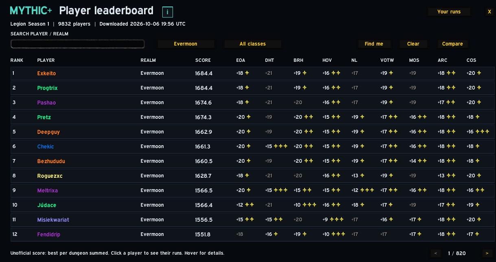
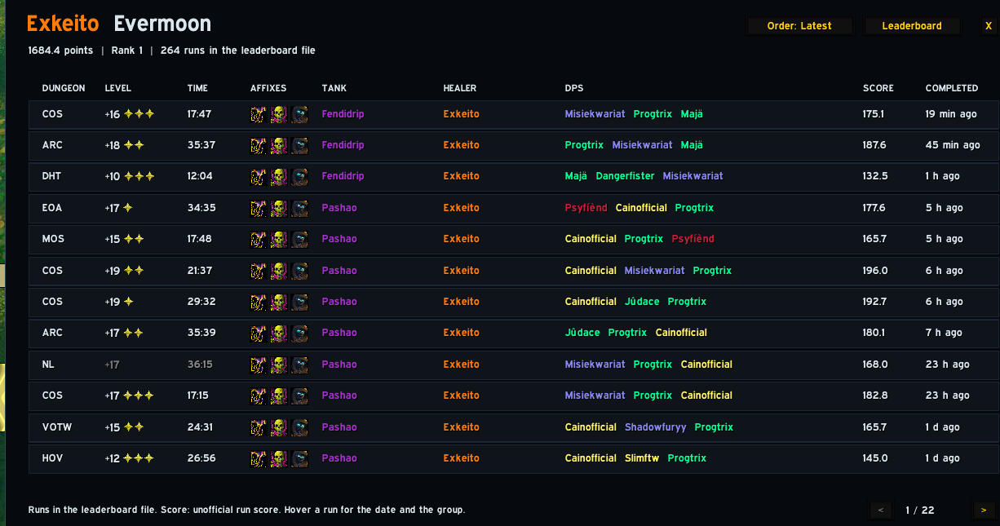
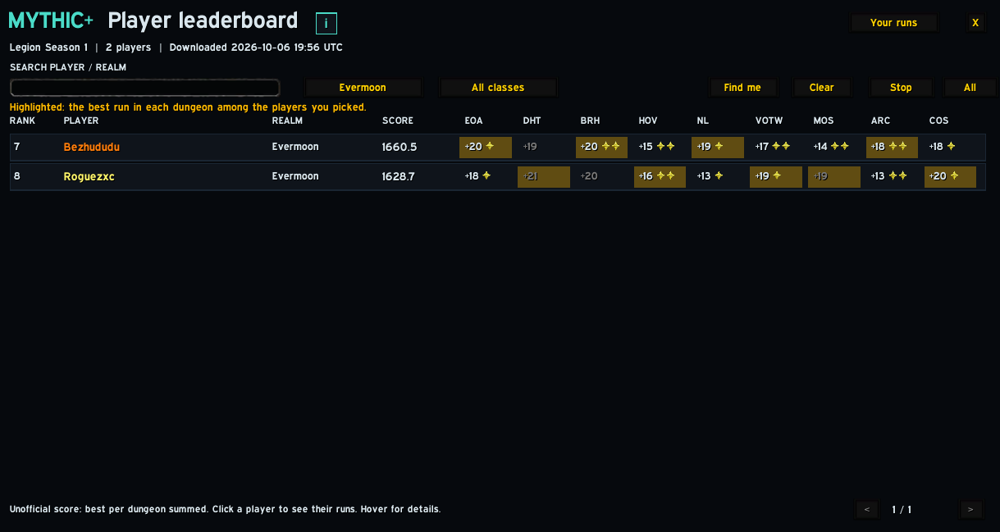
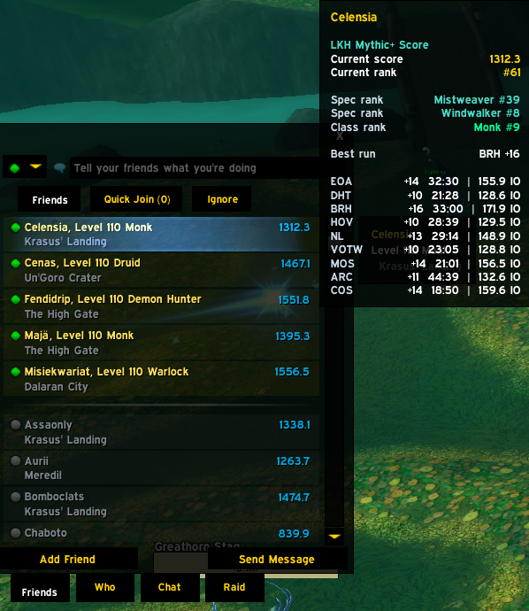
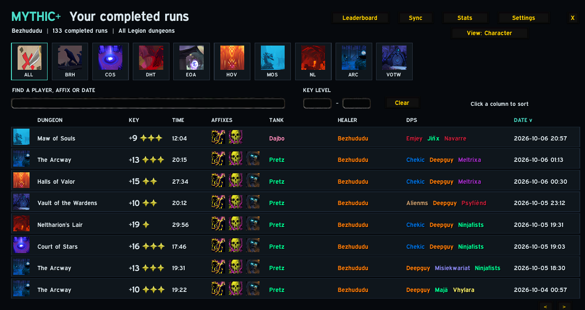
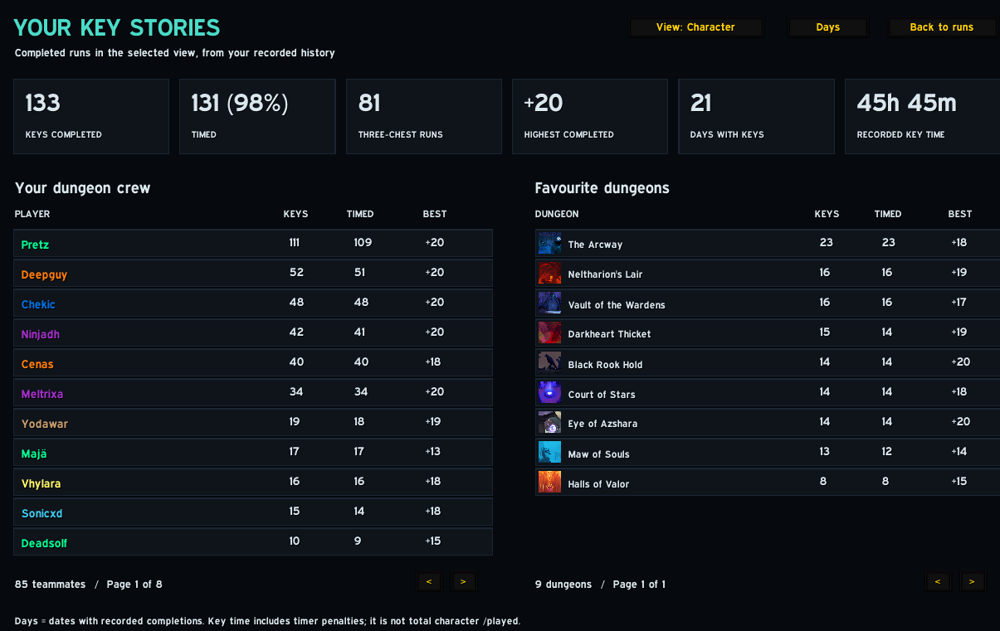

# Legion Key History

A Mythic+ addon for **Legion (7.3.5) on Tauri** — Evermoon, Tauri and Warriors of Darkness.
It keeps a journal of every key you complete and shows Raider.IO-style scores and ranks for
everyone on the Tauri Mythic+ leaderboard, right in the game.

## ⬇️ [Download LegionKeyHistory.zip](https://github.com/bez-wow/legionkeyhistory/releases/latest/download/LegionKeyHistory.zip)

## Get started in 3 steps

**1. Install.** Extract the zip into `World of Warcraft\Interface\AddOns\`, so you end up with
`Interface\AddOns\LegionKeyHistory\LegionKeyHistory.toc`. Start WoW and enable the addon.
(Use the download link above, not GitHub's green "Code" button — that zip has the wrong folder name.)

**2. Turn on hourly leaderboard updates.**

> [!IMPORTANT]
> The leaderboard inside the zip is a snapshot from the day you downloaded it. To keep scores
> and ranks current, open the addon folder, double-click **`LKH Updater.cmd`** and choose
> **1. Install the hourly leaderboard update**. It updates in the background every hour
> (`/reload` in WoW to load the newest one). No .exe, Python, account or API key needed.

**3. Import your history.** In game, open **Settings → Data → Import from file** (or type
`/lkh import`). This adds every key your character already has on the leaderboard, so your
journal and stats aren't empty. New keys are recorded automatically from now on.

New addon versions: run `LKH Updater.cmd` again and choose **Update the addon**. The addon also
tells you in chat when a new version is out.

**Prefer the web?** The same leaderboard is on
[Tauri Achievements](https://tauriachievements.github.io/mythic-plus?view=players).

## What it does

- **Scores everywhere:** friends list, group finder applicants and search results show each
  player's score; hover for their overall / spec / class rank and best key per dungeon.
- **Leaderboard** (`/lkh lb`): search, realm and class filters, click a player to see all their
  runs, or **Compare** up to five players with the best run per dungeon highlighted.
- **Personal Bests** next to the Dungeon Finder: your score, ranks and best Fortified and
  Tyrannical key per dungeon.
- **Journal** of every key you finish, with tank / healer / DPS, affixes and time; stats on
  your favourite dungeons and the people you play with.
- **Sync** runs with friends in your party, and **Import from file** to fill in your history.
- **Settings** (`/lkh config`): choose where scores show, the score style and colour, tooltip
  contents, sync behaviour, and profiles.

Keys you complete count straight away for everyone in that group; other runs arrive with the
next leaderboard update. Scores are unofficial: the sum of each character's best run score per
dungeon (formula from [Tauri Achievements](https://tauriachievements.github.io/mythic-plus/scoring)).

## Screenshots

| Leaderboard | A player's runs |
|---|---|
|  |  |
| **Compare** | **Friends list** |
|  |  |
| **Your journal** | **Stats** |
|  |  |

## Commands

| Command | Opens |
|---|---|
| `/lkh` | your journal |
| `/lkh lb` | the leaderboard |
| `/lkh config` | settings |
| `/lkh sync` | sync with a party member |
| `/lkh import` | import your runs from the leaderboard file |
